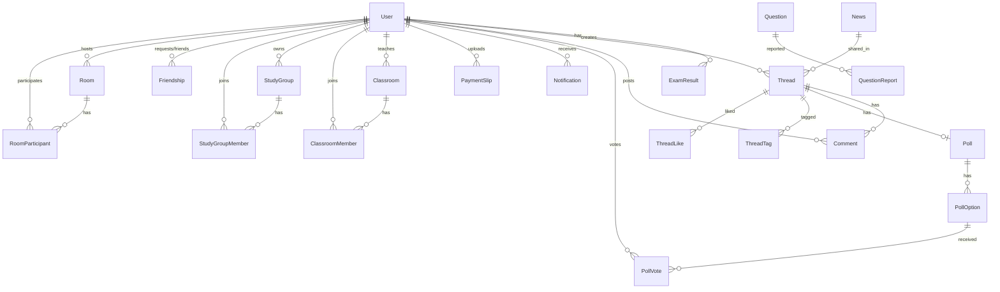

# Database Documentation

This document provides a detailed overview of the database schema for the PreExam application. The application uses **SQLite** as the database engine and **Sequelize** as the ORM.

## Entity Relationship Diagram

## Schema Details

### 1. Users & Authentication

#### **User** (`users`)
Stores user account information, including authentication details and profile data.

| Column | Type | Nullable | Description |
| :--- | :--- | :--- | :--- |
| `id` | INTEGER | No | Primary Key, Auto Increment |
| `public_id` | UUID | No | Unique public identifier (UUIDv4) |
| `email` | STRING | No | Unique email address |
| `password_hash` | STRING | Yes | Hashed password (null for social login) |
| `google_id` | STRING | Yes | Google OAuth ID |
| `facebook_id` | STRING | Yes | Facebook OAuth ID |
| `wallet_address` | STRING | Yes | Web3 Wallet Address |
| `display_name` | STRING | No | User's display name |
| `avatar` | STRING | Yes | URL to avatar image |
| `role` | ENUM | No | 'admin', 'user', 'teacher' (Default: 'user') |
| `plan_type` | ENUM | No | 'free', 'premium' (Default: 'free') |
| `status` | ENUM | No | 'active', 'banned' (Default: 'active') |
| `premium_expiry` | DATE | Yes | Expiry date for premium plan |

#### **Friendship** (`friendships`)
Manages friend requests and confirmed friendships between users.

| Column | Type | Nullable | Description |
| :--- | :--- | :--- | :--- |
| `id` | INTEGER | No | Primary Key |
| `user_id` | INTEGER | No | Requester ID (FK -> User) |
| `friend_id` | INTEGER | No | Recipient ID (FK -> User) |
| `status` | ENUM | No | 'pending', 'accepted' |

#### **PaymentSlip** (`payment_slips`)
Stores payment proof uploaded by users for premium upgrades.

| Column | Type | Nullable | Description |
| :--- | :--- | :--- | :--- |
| `id` | INTEGER | No | Primary Key |
| `user_id` | INTEGER | No | Submitter ID (FK -> User) |
| `amount` | DECIMAL | No | Payment amount |
| `slip_image` | STRING | No | Path/URL to slip image |
| `status` | ENUM | No | 'pending', 'approved', 'rejected' |

#### **Notification** (`notifications`)
Stores system and social notifications for users.

| Column | Type | Nullable | Description |
| :--- | :--- | :--- | :--- |
| `id` | INTEGER | No | Primary Key |
| `user_id` | INTEGER | No | Recipient ID (FK -> User) |
| `type` | STRING | No | 'like', 'comment', 'reply', 'system' |
| `source_id` | INTEGER | Yes | ID of related entity (e.g., thread_id) |
| `is_read` | BOOLEAN | No | Read status (Default: false) |
| `message` | STRING | Yes | Optional notification text |

---

### 2. Content & Community

#### **News** (`news`)
Stores news articles and announcements.

| Column | Type | Nullable | Description |
| :--- | :--- | :--- | :--- |
| `id` | INTEGER | No | Primary Key |
| `title` | STRING | No | News title |
| `content` | TEXT | No | Full HTML content |
| `summary` | TEXT | Yes | Short summary |
| `category` | STRING | Yes | News category |
| `image_url` | STRING | Yes | Cover image URL |
| `keywords` | STRING | Yes | SEO/Search keywords |

#### **Thread** (`threads`)
Community discussion threads/posts.

| Column | Type | Nullable | Description |
| :--- | :--- | :--- | :--- |
| `id` | INTEGER | No | Primary Key |
| `user_id` | INTEGER | No | Author ID (FK -> User) |
| `title` | STRING | No | Thread title |
| `content` | TEXT | No | Thread content |
| `category` | STRING | No | Thread category |
| `shared_news_id` | INTEGER | Yes | Linked News ID (FK -> News) |
| `views` | INTEGER | No | View count |
| `likes` | INTEGER | No | Like count |

#### **Comment** (`comments`)
Comments on threads. Supports nesting (replies).

| Column | Type | Nullable | Description |
| :--- | :--- | :--- | :--- |
| `id` | INTEGER | No | Primary Key |
| `thread_id` | INTEGER | No | Thread ID (FK -> Thread) |
| `user_id` | INTEGER | No | Author ID (FK -> User) |
| `content` | TEXT | No | Comment text |
| `parent_id` | INTEGER | Yes | Parent Comment ID (for replies) |

#### **Poll** (`polls`)
Polls attached to threads.

| Column | Type | Nullable | Description |
| :--- | :--- | :--- | :--- |
| `id` | INTEGER | No | Primary Key |
| `thread_id` | INTEGER | No | Thread ID (FK -> Thread) |
| `question` | STRING | No | Poll question |
| `expires_at` | DATE | Yes | Expiration time |

#### **ReportedContent** (`reported_content`)
User reports on threads or comments.

| Column | Type | Nullable | Description |
| :--- | :--- | :--- | :--- |
| `id` | INTEGER | No | Primary Key |
| `reporter_id` | INTEGER | No | User reporting (FK -> User) |
| `target_type` | ENUM | No | 'thread', 'comment' |
| `target_id` | INTEGER | No | ID of reported item |
| `reason` | STRING | No | Reason for report |

---

### 3. Exams & Learning

#### **Question** (`questions`)
Bank of exam questions.

| Column | Type | Nullable | Description |
| :--- | :--- | :--- | :--- |
| `id` | INTEGER | No | Primary Key |
| `question_text` | TEXT | No | The question itself |
| `correct_answer` | ENUM | No | 'A', 'B', 'C', 'D' |
| `explanation` | TEXT | Yes | Explanation for the answer |
| `category` | STRING | No | 'local_gov', 'ocsc' |
| `subject` | STRING | No | 'thai', 'english', 'law' |
| `difficulty` | INTEGER | No | Difficulty level (0-100) |

#### **ExamResult** (`exam_results`)
Stores results of user exams/practices.

| Column | Type | Nullable | Description |
| :--- | :--- | :--- | :--- |
| `id` | INTEGER | No | Primary Key |
| `user_id` | INTEGER | No | User ID (FK -> User) |
| `score` | INTEGER | No | User's score |
| `total_score` | INTEGER | No | Maximum possible score |
| `mode` | ENUM | No | 'practice', 'simulation', 'classroom' |
| `subject_scores`| TEXT | Yes | JSON string of scores per subject |
| `time_taken` | INTEGER | No | Time taken in seconds |

#### **Classroom** (`classrooms`)
Virtual classrooms managed by teachers.

| Column | Type | Nullable | Description |
| :--- | :--- | :--- | :--- |
| `id` | INTEGER | No | Primary Key |
| `teacher_id` | INTEGER | No | Teacher ID (FK -> User) |
| `name` | STRING | No | Classroom name |
| `code` | STRING | No | Unique join code |

#### **StudyGroup** (`study_groups`)
User-created study groups.

| Column | Type | Nullable | Description |
| :--- | :--- | :--- | :--- |
| `id` | INTEGER | No | Primary Key |
| `owner_id` | INTEGER | No | Group Owner ID (FK -> User) |
| `name` | STRING | No | Group name |

---

### 4. Multiplayer & Real-time

#### **Room** (`rooms`)
Multiplayer exam rooms.

| Column | Type | Nullable | Description |
| :--- | :--- | :--- | :--- |
| `id` | INTEGER | No | Primary Key |
| `code` | STRING | No | Unique room code |
| `mode` | ENUM | No | 'exam', 'tutor', 'event' |
| `host_user_id` | INTEGER | No | Host ID (FK -> User) |
| `status` | ENUM | No | 'waiting', 'in_progress', 'finished' |
| `question_ids` | JSON | Yes | List of Question IDs in the room |

#### **RoomParticipant** (`room_participants`)
Users in a multiplayer room.

| Column | Type | Nullable | Description |
| :--- | :--- | :--- | :--- |
| `id` | INTEGER | No | Primary Key |
| `room_id` | INTEGER | No | Room ID (FK -> Room) |
| `user_id` | INTEGER | No | User ID (FK -> User) |
| `score` | INTEGER | No | Current score |
| `status` | ENUM | No | 'joined', 'ready', 'finished' |

---

### 5. System & Misc

#### **ContactMessage** (`contact_messages`)
Messages sent via the contact form.

#### **MarqueeMessage** (`marquee_messages`)
Scrolling messages displayed on the site.

#### **SearchLog** (`search_logs`)
Logs of user search queries for analytics.
